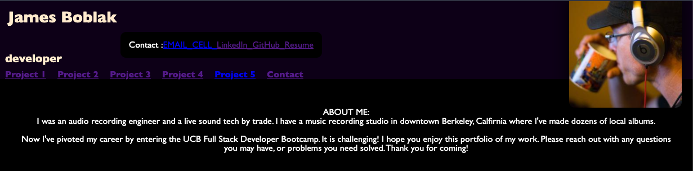

# jamesboblak.github.io
## Welcome to my online portfolio

James Boblak, full stack developer

<!-- Header image -->

The Header features links to project details within the page.

<!-- Statement of purpose -->
## Purpose
I am forever updating this site to reflect the evolution of my career and craft.  Please fork any repositories you like, and also feel free to comment or reach out.

## Technology utilized to create this page:
<!-- HTML Pionts -->
* HTML
    * Semantic tagging
    * Clear commenting

    <!-- CSS Points -->
* CSS
    * Concise use of Classes and ID's
    * Variables defined for radius and margin/padding settings
    * Flex-box architecture
    * Mouse event listeners